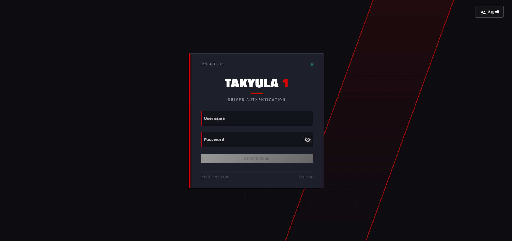
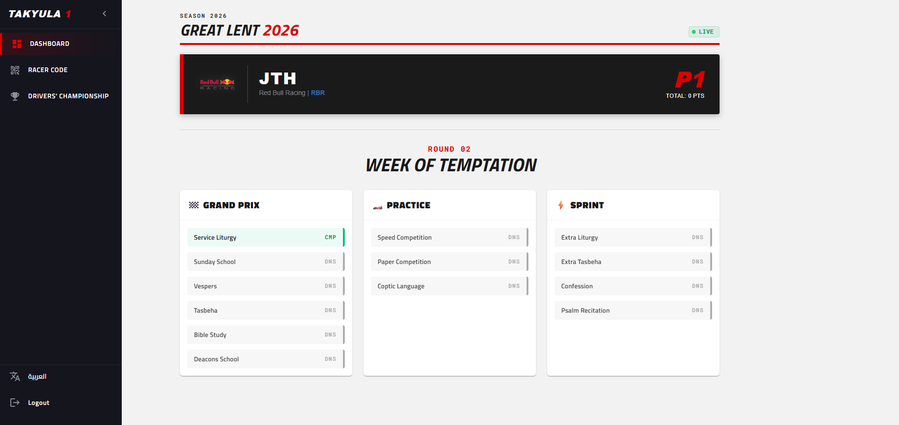
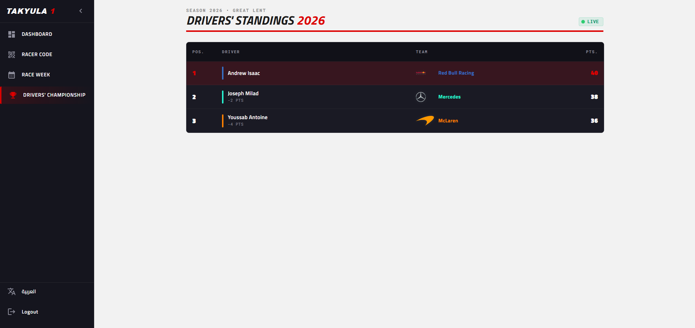
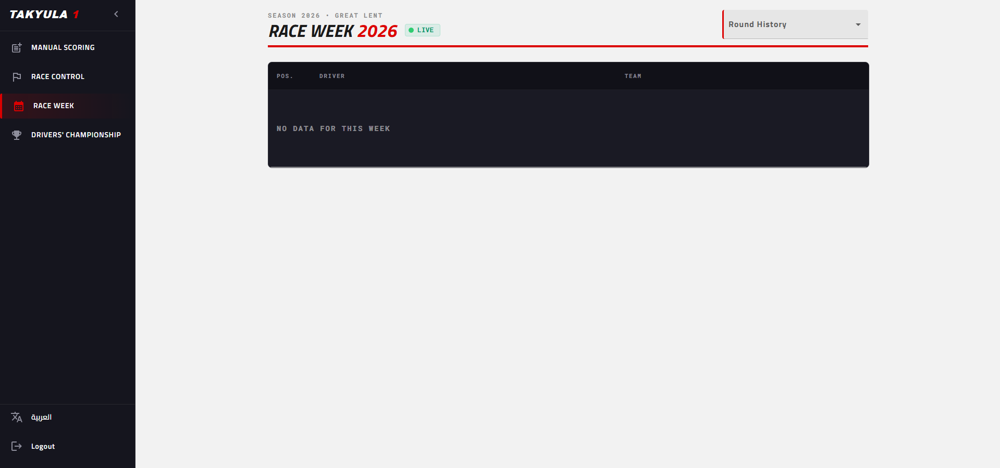
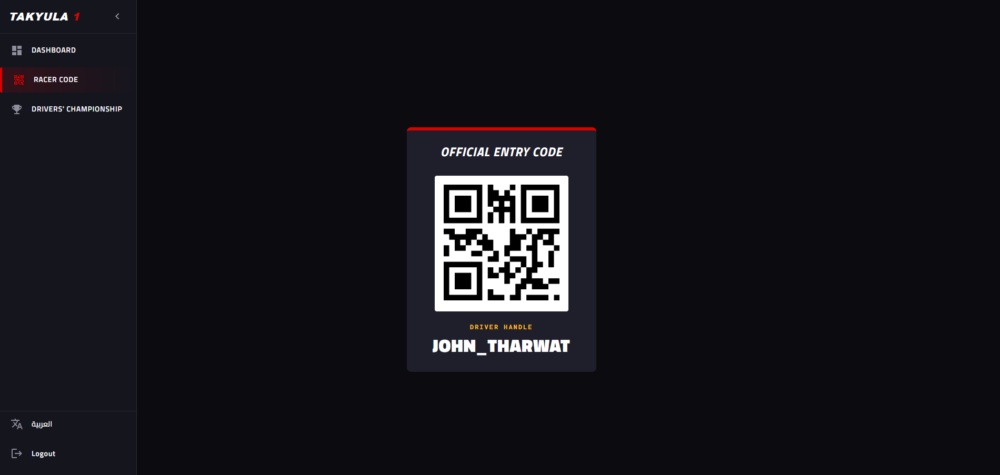
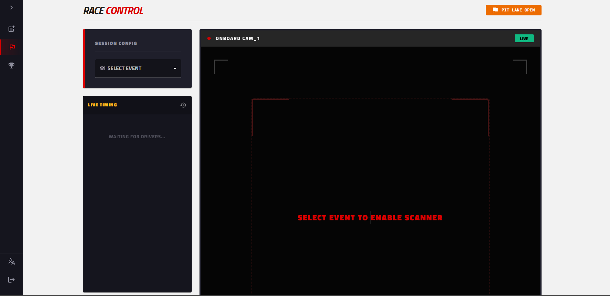
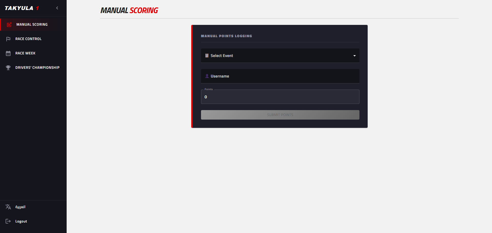

# Sunday School Fast Competition Platform (Takyula 1)

A web application built for churches to help Sunday school students compete during fasting seasons (e.g., Great Lent) by attending events and earning points. The platform is themed around Formula 1 racing, where students are "racers" competing for the championship.

## Overview

Students participate in church events and receive points for attendance. The platform tracks scores, displays a leaderboard, and provides role-based access for servants and students.

## Tech Stack

**Frontend**
- React 19 with TypeScript
- Material UI (MUI)
- React Router
- i18next (multi-language support)
- QR code scanning and generation

**Backend**
- Java 25 with Spring Boot 4
- Spring Security + JWT authentication
- Spring Data JPA + Flyway migrations
- PostgreSQL

## Project Structure

```
/
├── frontend/   # React + TypeScript web application
└── backend/    # Spring Boot REST API
```

## Roles

| Role | Description |
|---|---|
| `SUPER_SERVANT` | Full access to all pages including manual scoring |
| `SERVANT` | Can access race control to manage event attendance |
| `STUDENT` | Can view their own dashboard and the leaderboard |

## Pages

| Page | Available To |
|---|---|
| Login | All |
| Drivers Championship (Competition Leaderboard) | All |
| Race Week (Weekly Leaderboard) | All |
| Dashboard | `STUDENT` |
| Race Control | `SERVANT`, `SUPER_SERVANT` |
| Manual Scoring | `SUPER_SERVANT` |

## Supported Languages

| Language | Code |
|---|---|
| English | `en` |
| Arabic | `ar` |

## Getting Started

### Prerequisites

- Node.js and npm
- Java 25
- Docker (for the database)

### Database

Start the PostgreSQL database using Docker:

```bash
cd backend
docker-compose up -d
```

### Backend

```bash
cd backend
./mvnw spring-boot:run
```

### Frontend

```bash
cd frontend
npm install --legacy-peer-deps
npm start
```

The frontend runs on `http://localhost:3000` and proxies API requests to the backend.

## Screenshots

- Login page

- Dashboard

- Drivers Championship (Competition Leaderboard)

- Race Week (Weekly Leaderboard)

- Racer QR Code page

- Race Control

- Manual Scoring
